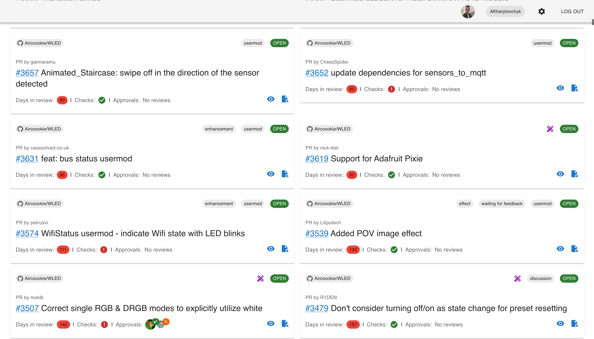
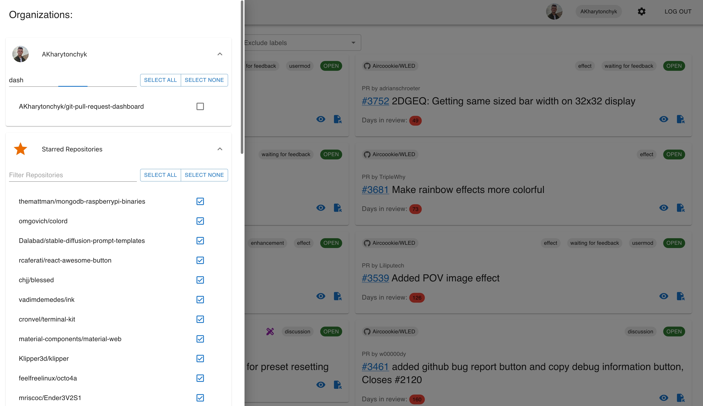

# GitHub PR Dashboard

The GitHub PR Dashboard is a comprehensive tool designed to streamline the monitoring of pull requests across multiple repositories within the GitHub platform. Ideal for developers and teams managing multiple projects, it offers a unified view of PRs, facilitating better tracking and management.

## Demo Page

[Go to demo -->](https://akharytonchyk.github.io/git-pull-request-dashboard/)

## Features

- **Connect with GitHub**: Securely connect using GitHub Personal Access Tokens (PAT).
- **Organization and Repository Selection**: Choose which organizations and repositories you want to monitor within the dashboard.
- **Pull Request Overview**: Get a consolidated view of all pull requests across your selected repositories.

## UI Example

### PR Dashboard



### Settings Overview



## Getting Started

Follow these instructions to get your GitHub PR Dashboard up and running on your local machine for development and testing purposes.

### Prerequisites

- Node.js (latest stable version)
- A GitHub account
- A generated GitHub Personal Access Token with `repo` and `read:org` permissions

### Installation

1. Clone the repository:

   ```bash
   gh repo clone AKharytonchyk/git-pull-request-dashboard
   ```

2. Navigate to the project directory:

   ```bash
   cd github-pr-dashboard
   ```

3. Install the necessary dependencies:

   ```bash
   npm install
   ```

4. Start the application:

   ```bash
   npm start
   ```

   This will run the app in development mode. Open [http://localhost:3000](http://localhost:3000) to view it in the browser.

## How to Use

### Setting Up Your Personal Access Token

1. Log in to your GitHub account.
2. Navigate to Settings > Developer settings > Personal access tokens > Generate new token.
3. Select `repo` and `read:org` scopes.
4. Generate the token and copy it.

### Connecting Your GitHub Account

- On the GitHub PR Dashboard, enter your PAT and connect your GitHub account.

### Selecting Repositories

- Choose the organizations and repositories you want to monitor through the dashboard.

## Contributing

We welcome contributions to the GitHub PR Dashboard! Please read our [Contributing Guide](CONTRIBUTING.md) (when it will be available) for details on our code of conduct and the process for submitting pull requests to us.

## License

This project is licensed under the MIT License - see the [LICENSE](LICENSE.md) file for details.

## Acknowledgments

Special thanks to all contributors who have helped to build and refine this tool.
