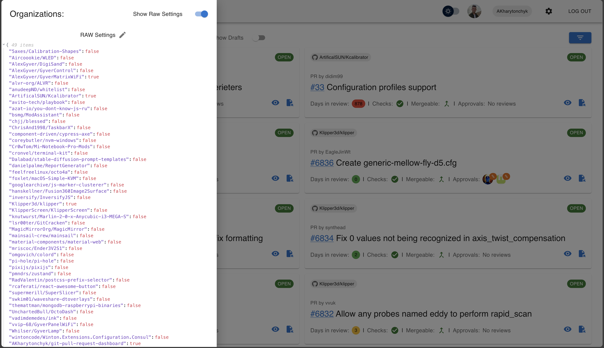

# GitHub PR Dashboard

The GitHub PR Dashboard is a comprehensive tool designed to streamline the monitoring of pull requests across multiple repositories within the GitHub platform. Ideal for developers and teams managing multiple projects, it offers a unified view of PRs, facilitating better tracking and management.

## Demo Page

[Go to demo -->](https://akharytonchyk.github.io/git-pull-request-dashboard/)

## Documentation

- 📖 [Deployment Guide](docs/DEPLOYMENT.md) - Production deployment and CSP configuration
- 🔒 [Security Guidelines](docs/SECURITY.md) - Token management and security best practices  
- ⚡ [Performance Guidelines](docs/PERFORMANCE.md) - Optimization and caching strategies

## Features

- **Secure GitHub Integration**: Securely connect using GitHub Personal Access Tokens (PAT) with enhanced token management and automatic expiration.
- **Comprehensive Repository Access**: Access all repositories you have permissions for, including:
  - Public and private repositories you own
  - Private repositories you collaborate on
  - Organization repositories (both public and private)
  - Repositories you have access to through team memberships
- **Organization and Repository Selection**: Choose which organizations and repositories you want to monitor within the dashboard.
- **Pull Request Overview**: Get a consolidated view of all pull requests across your selected repositories.
- **Issue Overview**: Get a consolidated view of all issues across your selected repositories and organizations.
- **Security Vulnerability Monitoring**: Monitor Dependabot security alerts across repositories with:
  - Real-time vulnerability counts by severity (Critical, High, Medium, Low)
  - Direct links to GitHub security pages for remediation
  - Support for both GitHub.com and GitHub Enterprise instances
  - Lazy loading and caching for optimal performance
- **Dark Mode**: Toggle between light and dark themes with persistent user preferences.
- **Settings Management**: Easily manage your settings within the app. Setting sharing is now available via raw setting toggle.
- **Repository Focus View**: Access repository view and navigate to see PRs and Issues for this particular repository.
- **Enhanced Error Handling**: User-friendly error messages and notifications with automatic retry mechanisms.
- **Performance Optimizations**: Efficient caching, rate limiting, and lazy loading for improved user experience.

## UI Example

### PR Dashboard


### Settings Overview




### Failed Checks


### Issues Dashboard


### Repository Dashboard


## Getting Started

Follow these instructions to get your GitHub PR Dashboard up and running on your local machine for development and testing purposes.

### Prerequisites

- Node.js (latest stable version)
- A GitHub account
- A generated GitHub Personal Access Token with `repo` and `read:org` permissions

### Installation

1. Clone the repository:

   ```bash
   gh repo clone AKharytonchyk/git-pull-request-dashboard
   ```

2. Navigate to the project directory:

   ```bash
   cd github-pr-dashboard
   ```

3. Configure environment variables (optional):

   ```bash
   cp .env.example .env.local
   ```
   
   Edit `.env.local` to customize API endpoints and rate limiting if needed. See [Environment Configuration](#environment-configuration) for details.

4. Install the necessary dependencies:

   ```bash
   npm install
   ```

5. Start the application:

   ```bash
   npm start
   ```

   This will run the app in development mode. Open [http://localhost:5173](http://localhost:5173) to view it in the browser.

## Security and Performance

This application implements enterprise-grade security and performance optimizations. For detailed information, see:

- 🔒 **[Security Guidelines](docs/SECURITY.md)** - Token security, CSP configuration, and best practices
- ⚡ **[Performance Guidelines](docs/PERFORMANCE.md)** - Caching strategies, optimization techniques, and monitoring
- 🚀 **[Deployment Guide](docs/DEPLOYMENT.md)** - Production deployment with dynamic CSP and environment configuration

## Environment Configuration

The application can be customized using environment variables. Copy `.env.example` to `.env.local` and modify as needed:

```bash
cp .env.example .env.local
```

### Available Variables

| Variable | Default | Description |
|----------|---------|-------------|
| `VITE_GITHUB_API_URL` | `https://api.github.com` | GitHub API endpoint. Use your GitHub Enterprise Server URL if applicable |
| `VITE_GITHUB_AVATAR_URL` | Auto-detected | GitHub avatar URL (optional - auto-detected from API URL) |
| `VITE_GITHUB_BASE_URL` | Auto-detected | GitHub base URL (optional - auto-detected from API URL) |
| `VITE_MAX_REQUESTS_PER_MINUTE` | `200` | Rate limit for API requests (1-5000) |

### Examples

**GitHub.com (default):**
```env
VITE_GITHUB_API_URL=https://api.github.com
VITE_MAX_REQUESTS_PER_MINUTE=200
```

**ACME GitHub Enterprise:**
```env
VITE_GITHUB_API_URL=https://ghe.acme.com/api/v3
VITE_GITHUB_AVATAR_URL=https://avatars.ghe.acme.com
VITE_GITHUB_BASE_URL=https://ghe.acme.com
VITE_MAX_REQUESTS_PER_MINUTE=300
```

**GitHub Enterprise Server:**
```env
VITE_GITHUB_API_URL=https://ghe.your-company.com/api/v3
VITE_GITHUB_AVATAR_URL=https://avatars.ghe.your-company.com
VITE_GITHUB_BASE_URL=https://ghe.your-company.com
VITE_MAX_REQUESTS_PER_MINUTE=300
```

**High-traffic deployment:**
```env
VITE_GITHUB_API_URL=https://api.github.com
VITE_MAX_REQUESTS_PER_MINUTE=500
```

### Features

- **Auto-detection**: Avatar and base URLs are automatically derived from the API URL if not specified
- **Dynamic CSP**: Content Security Policy headers are automatically generated based on your GitHub environment
- **Validation**: All URLs are validated during application startup

## How to Use

### Setting Up Your Personal Access Token

1. Log in to your GitHub account.
2. Navigate to Settings > Developer settings > Personal access tokens > Generate new token.
3. Select `repo` and `read:org` scopes.
4. Generate the token and copy it.

**Security Note**: Your token is stored securely in session storage with automatic expiration for enhanced security.

### Connecting Your GitHub Account

- On the GitHub PR Dashboard, enter your PAT and connect your GitHub account.
- The application will validate your token and provide feedback on successful authentication.
- Your authentication session will automatically expire for security purposes.

### Selecting Repositories

- Choose the organizations and repositories you want to monitor through the dashboard.

## Troubleshooting

### Common Issues

**Authentication Failures**
- Verify your token has the correct permissions (`repo` and `read:org`)
- Check if your token has expired
- Ensure you're connected to the internet

**No Pull Requests Showing**
- Confirm you've selected repositories in the settings
- Check if the repositories have any open pull requests
- Verify your token has access to the selected repositories

**Rate Limiting**
- The application automatically handles GitHub API rate limits
- If you encounter rate limiting, wait a few minutes and try again
- Consider reducing the number of monitored repositories if the issue persists

**Performance Issues**
- Clear your browser cache and session storage
- Reduce the number of monitored repositories
- Check your internet connection speed
- See [Performance Guidelines](docs/PERFORMANCE.md) for optimization tips

**Need Help?**
- 📖 [Deployment Guide](docs/DEPLOYMENT.md) for production setup
- 🔒 [Security Guidelines](docs/SECURITY.md) for token and security issues
- ⚡ [Performance Guidelines](docs/PERFORMANCE.md) for performance optimization

## Contributing

We welcome contributions to the GitHub PR Dashboard! Please read our [Contributing Guide](CONTRIBUTING.md) (when it will be available) for details on our code of conduct and the process for submitting pull requests to us.

## License

This project is licensed under the MIT License - see the [LICENSE](LICENSE.md) file for details.

## Acknowledgments

Special thanks to all contributors who have helped to build and refine this tool.
