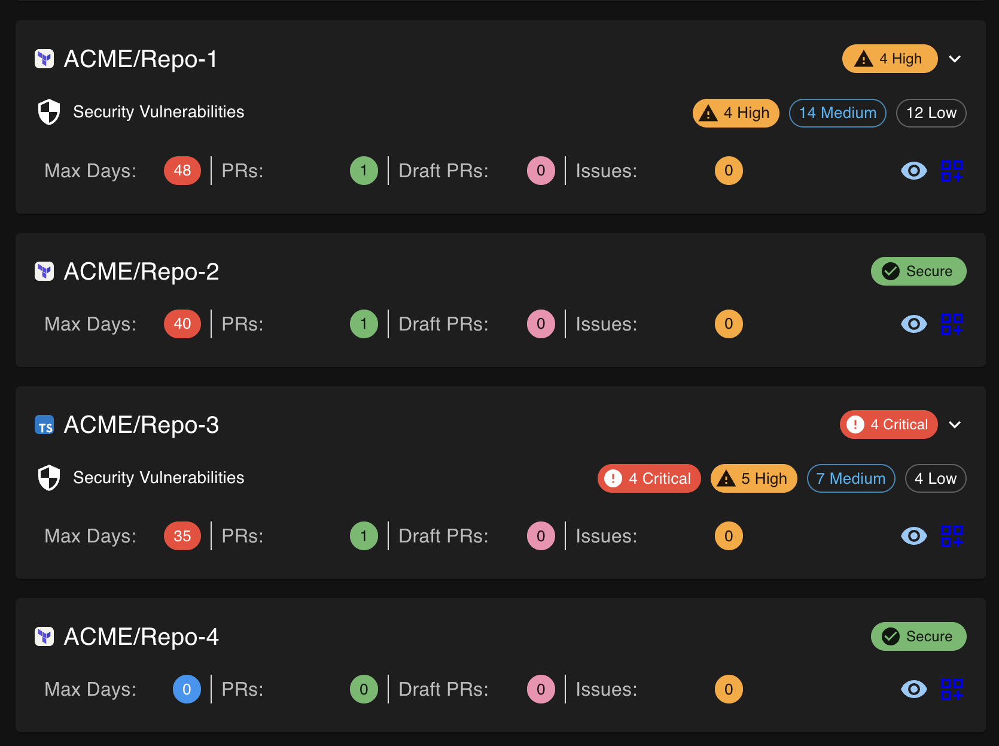

# 🛡️ Security Vulnerability Monitoring Release

## 🎉 Major New Feature: Dependabot Integration

We're excited to announce a major new feature that brings security vulnerability monitoring directly to your GitHub PR Dashboard! This release introduces comprehensive Dependabot alert integration with enterprise-grade support for both GitHub.com and GitHub Enterprise instances.

## ✨ What's New

### 🛡️ Security Vulnerability Monitoring
- **Real-time vulnerability tracking** across all your repositories
- **Severity-based indicators** showing Critical, High, Medium, and Low vulnerabilities  
- **Direct links** to GitHub security pages for immediate remediation
- **Lazy loading and caching** for optimal performance
- **Compact and expanded views** for flexible information display

### 🏢 Enterprise Support
- **GitHub Enterprise Server (GHE) compatibility** with dynamic URL generation
- **Automatic avatar fallbacks** for GHE authentication issues  
- **Dynamic Content Security Policy** adapting to your GitHub environment
- **Enhanced repository access** including private repos and organization memberships

### 🎨 UI/UX Improvements
- **Consistent vulnerability indicators** across all repository cards
- **Expandable detail views** showing vulnerability breakdowns by severity
- **Clickable severity chips** linking directly to filtered security pages
- **Clean, professional interface** with proper loading states and error handling

## 📸 Screenshots

### Repository Overview with Vulnerability Indicators


### Vulnerability Monitoring in Action
<!-- Placeholder: Add screenshot of repository cards showing vulnerability indicators -->
*Please add screenshot showing:*
- *Repository cards with different vulnerability states (Secure, Critical, High, etc.)*
- *Expand buttons on repositories with vulnerabilities*
- *Mix of secure and vulnerable repositories*

### Expanded Vulnerability Details  
<!-- Placeholder: Add screenshot of expanded vulnerability details -->
*Please add screenshot showing:*
- *Expanded view with individual severity chips (Critical, High, Medium, Low)*
- *Clickable chips with hover states*
- *Clean layout showing vulnerability breakdown*

### GitHub Enterprise Support
<!-- Placeholder: Add screenshot showing GHE compatibility -->
*Please add screenshot showing:*
- *Dashboard working with GitHub Enterprise Server*
- *Different avatar sources and URLs*
- *Enterprise-specific security page links*

## 🚀 Technical Highlights

### New Components
- **VulnerabilityIndicator**: Sophisticated React component with lazy loading and caching
- **Avatar fallback utilities**: Handles GHE authentication seamlessly  
- **Dynamic CSP generation**: Adapts security policies to your GitHub environment

### Enhanced Services
- **Extended GitService**: New methods for Dependabot alert fetching and summarization
- **Improved repository access**: Now includes private repos you collaborate on
- **Error handling**: Graceful handling of permissions and API errors

### Performance & Security
- **React Query integration**: Efficient caching and background updates
- **Intersection Observer**: Only loads vulnerability data when visible
- **Rate limiting**: Respectful API usage with intelligent retry logic
- **CSP improvements**: Removed unsupported directives, enhanced compatibility

## 🔧 Configuration

### Required Permissions
For vulnerability monitoring, ensure your GitHub Personal Access Token includes:
- `security_events` scope for accessing Dependabot alerts
- `repo` scope for repository access
- `read:org` scope for organization repositories

### Environment Variables
New optional environment variables for customization:
```bash
# GitHub Enterprise Server support
VITE_GITHUB_API_URL=https://ghe.your-company.com/api/v3
VITE_GITHUB_AVATAR_URL=https://avatars.ghe.your-company.com  # Optional - auto-detected
VITE_GITHUB_BASE_URL=https://ghe.your-company.com            # Optional - auto-detected
```

## 📚 Documentation

We've added comprehensive documentation for the new features:

- 🛡️ **[Dependabot Integration Guide](docs/DEPENDABOT_INTEGRATION.md)** - Complete setup and usage guide
- 🔒 **[Security Guidelines](docs/SECURITY.md)** - Updated with vulnerability monitoring best practices
- 🚀 **[Deployment Guide](docs/DEPLOYMENT.md)** - Enhanced CSP configuration for enterprise environments

## 🐛 Bug Fixes & Improvements

### UI Consistency
- Fixed vulnerability indicator styling inconsistencies
- Standardized chip sizing and alignment across repository cards
- Improved expand button behavior and positioning

### Repository Access  
- Enhanced repository fetching to include all accessible repositories
- Added support for private repositories through team memberships
- Better handling of organization repositories

### Security & Performance
- Removed unsupported CSP directives (frame-ancestors, X-Frame-Options in meta tags)
- Improved avatar loading with automatic GitHub.com fallbacks
- Enhanced error handling with user-friendly messages

## 🔄 Migration Notes

### Existing Users
- No breaking changes for existing functionality
- Vulnerability monitoring is automatically enabled for repositories with appropriate permissions
- New documentation links are available in the application

### New Permissions
If you want to use vulnerability monitoring:
1. Update your GitHub Personal Access Token to include `security_events` scope
2. Re-authenticate in the application
3. Vulnerability indicators will automatically appear on repository cards

## 🎯 What's Next

This release sets the foundation for advanced security monitoring features. Future releases may include:
- Custom vulnerability filtering and alerts
- Security trend analytics and reporting  
- Integration with security scanning tools
- Automated vulnerability remediation workflows

## 🙏 Acknowledgments

Special thanks to the community for feedback and testing that made this comprehensive security feature possible. Your input helped us create a robust, enterprise-ready solution that works seamlessly across different GitHub environments.

---

**Full Changelog**: [Compare changes](https://github.com/AKharytonchyk/git-pull-request-dashboard/compare/previous-version...current-version)

**Download**: Get the latest release from the [Releases page](https://github.com/AKharytonchyk/git-pull-request-dashboard/releases)
